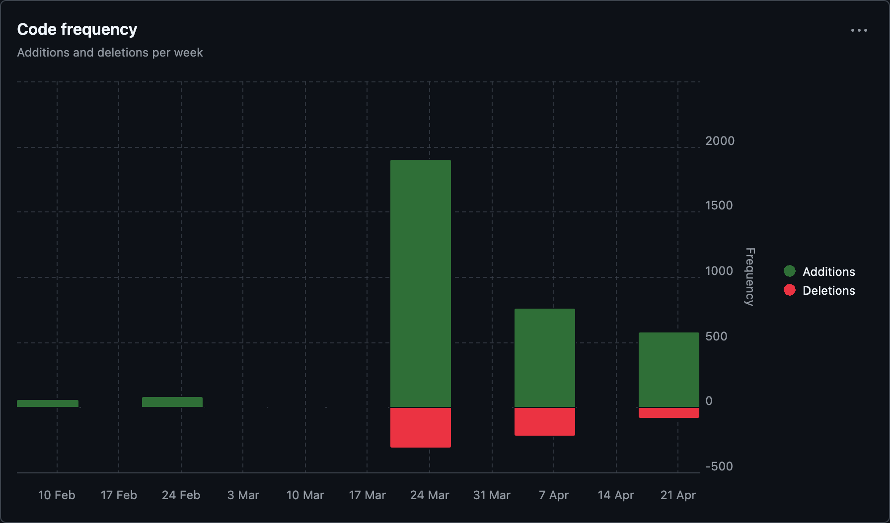
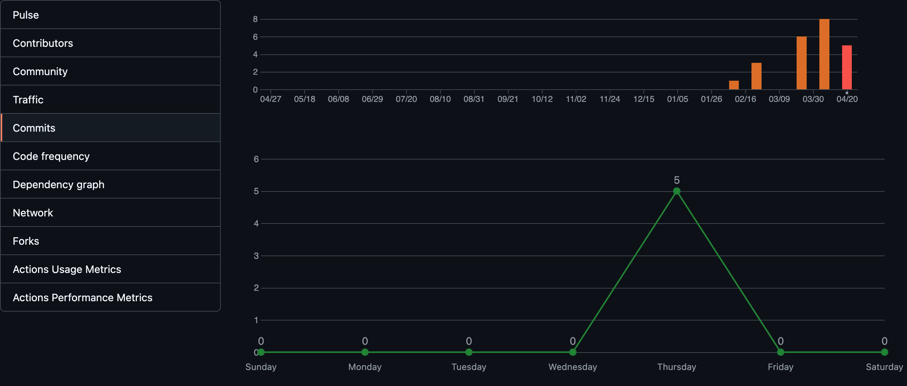
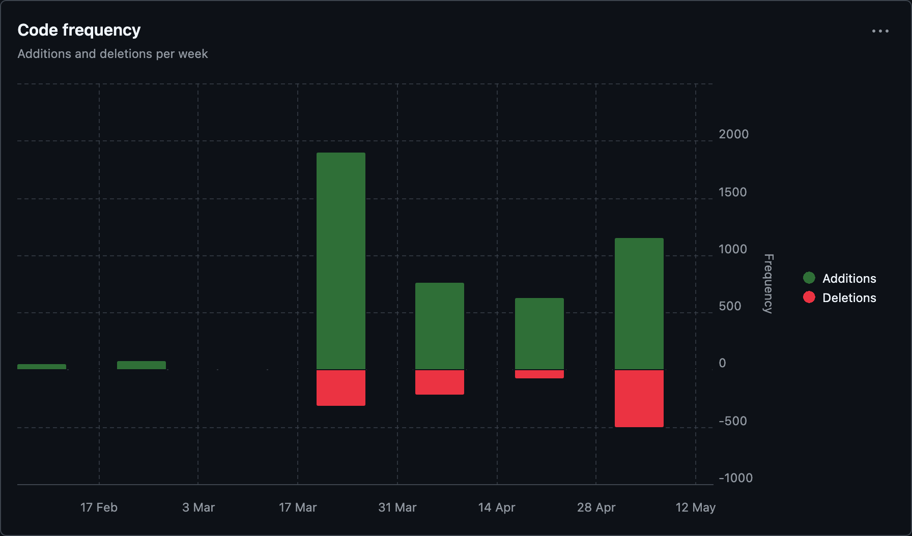
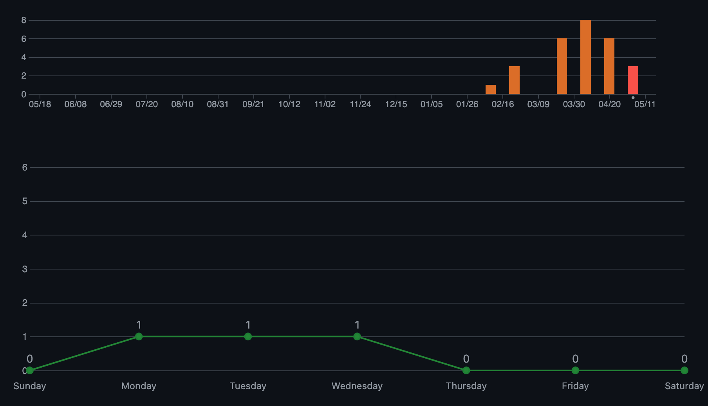
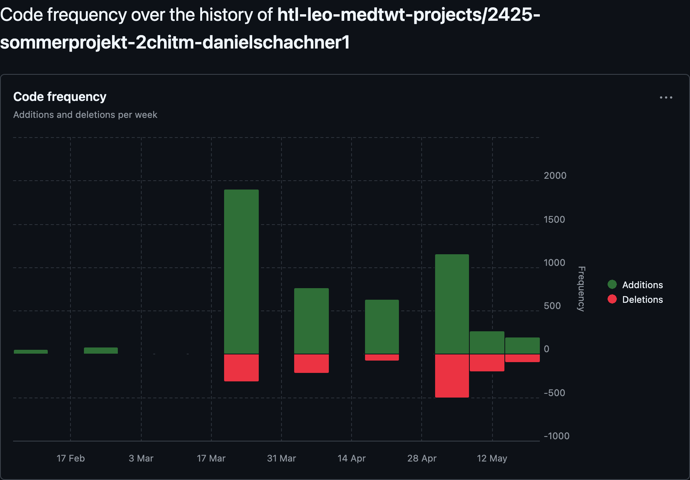
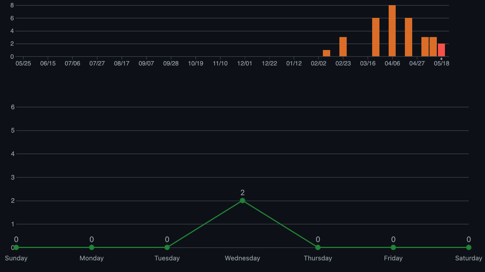

# Sprint-Dokumentation

## Name: Daniel Schachner

## Klasse: 2CHITM

## Projektname: FindYourSpace

## Link zum Github-Repo: https://github.com/htl-leo-medtwt-projects/2425-sommerprojekt-2chitm-danielschachner1.git

---

### Neuerungen seit dem letzten Sprint:

- **UI/UX-Prototyp**:

  - Implementierung der Navigationsleiste mit Links zu Startseite, Orte buchen und Community.
  - Integration des Hero-Bereichs mit Suchleiste und Hintergrundbild.^
  - Erstellung des „Top-Bewertete Orte“-Abschnitts.
  - Verbessern der interaktiven Karte ( **Leaflet.js**).

- **Design**:
  - Nutzung von **TailwindCSS** für ein ansprechendes, responsives Layout.
  - Gestaltung von Hover-Effekten und visuellem Design.

### Screenshot der GitHub-Insights Statistik:

### Ziele bis zum nächsten Sprint:

- Weiterentwicklung der interaktiven Karte.
- Filterfunktion für Orte nach Kategorien/Bewertungen.
- Vorbereitungen für die Backend-Integration.

---

### Neuerungen seit dem letzten Sprint:

- **UI/UX-Prototyp**:

  - Hinzufügen einer interaktiven Karte mit Orten (mit **Leaflet.js**).

- **Design**:

  - Nutzung von **TailwindCSS** für ein ansprechendes, responsives Layout.
  - Gestaltung von Hover-Effekten und visuellem Design.

- **Login-Funktionalität**:

  - Implementierung einer Login-Funktion über **LocalStorage**.
  - Validierung der Benutzerdaten und Fehlermeldungen bei fehlerhaften Logins.
  - Persistente Speicherung des Login-Status zwischen Browser-Sitzungen.

- **Dark Mode**:

  - Fixing von Dark-Mode-Problemen, um ein konsistentes Erscheinungsbild zu gewährleisten.

- **Filterfunktion**:

  - Weiterentwicklung der Filterfunktion für Orte nach Kategorien und Bewertungen.

- **Interaktive Karte (Leaflet.js)**:
  - Ausarbeitung der interaktiven Karte mit verbesserten Animationen und sanften Übergängen.
  - Hinzufügen eines Modals, das detaillierte Informationen zu einem Ort anzeigt, wenn ein Marker auf der Karte geklickt wird.

---

### Screenshot der GitHub-Insights Statistik:

  

---

### Ziele bis zum nächsten Sprint:

### Ziele bis zum nächsten Sprint:

1. **Suchfunktion auf der Startseite fertigstellen**:

   - Implementierung eines Vorschlagsmechanismus, der Orte basierend auf der Nutzereingabe anzeigt (z. B. "Bibliothek" zeigt alle Bibliotheken an).
   - Optimierung der Suchergebnisse für eine schnellere und präzisere Anzeige.

2. **Buchen-Funktion implementieren**:

   - Entwicklung einer Buchungsseite, auf der Nutzer Orte auswählen und buchen können.

3. **Konto-Management für angemeldete Nutzer**:

   - Implementierung eines Konto-Dashboards mit einer Übersicht über aktuelle und vergangene Buchungen.
   - Möglichkeit für Nutzer, ihre Buchungen zu stornieren oder zu bearbeiten.

4. **Persistente Buchungsdaten**:

   - Speicherung der Buchungsdaten im LocalStorage.
   - Sicherstellen, dass Buchungen auch nach einem Seitenrefresh erhalten bleiben.

5. **Optimierung des Nutzerprofils**:
   - Erweiterung des Profilbereichs zur Verwaltung persönlicher Daten wie Name, E-Mail und bevorzugte Einstellungen.
   - Option für Nutzer, ihr Passwort zu ändern oder ihre Profildaten zu aktualisieren.

### Screenshot der GitHub-Insights Statisktik:

---

### Neuerungen seit dem letzten Sprint:

- **Checkout-Seite**:

  - Entwicklung einer übersichtlichen **Checkout-Seite**, auf der Nutzer ihre ausgewählten Orte samt Datum und Uhrzeit überprüfen können.
  - Integration einer **Buchungsübersicht** mit dynamischer Anzeige der Buchungsdaten.
  - Hinzufügen eines **Bestätigungsdialogs**, der nach dem Absenden die Buchung visuell bestätigt.
  - Responsives Design mit Fokus auf Benutzerfreundlichkeit – insbesondere auf mobilen Geräten.

- **Konto verwalten / Buchungen stornieren und bearbeiten**:

  - Erstellung eines **„Mein Konto“-Bereichs**, zugänglich nur für eingeloggte Nutzer.
  - Übersicht über vergangene und aktuelle Buchungen.
  - Implementierung der **Stornierungsfunktion**: Nutzer können einzelne Buchungen mit einem Klick stornieren, die Daten werden aus dem LocalStorage entfernt.
  - Implementierung einer **Bearbeiten-Funktion**, um z. B. das Datum oder die Uhrzeit einer bestehenden Buchung zu ändern.
  - UI-Feedback mit Statusmeldungen

- **Datenspeicherung**:
  - Sämtliche Buchungs- und Profildaten werden vollständig über den **LocalStorage** verwaltet und gespeichert.
  - Persistente Datenspeicherung sorgt dafür, dass Daten auch nach einem Seiten-Reload erhalten bleiben.

---

### Ziele bis zum nächsten Sprint:

1. **Design-Optimierungen**

   - Feinjustierung des responsiven Layouts auf Mobil- und Tablet-Ansicht.
   - Konsistente Gestaltung aller UI-Komponenten (z. B. Buttons, Modals, Input-Felder).
   - Verbesserung der Benutzerführung auf der Checkout- und Konto-Seite.

2. **Passwort ändern-Funktion**

   - Hinzufügen einer Funktion im Benutzerprofil, mit der angemeldete Nutzer ihr Passwort ändern können.
   - Validierung der neuen Eingabe (z. B. Mindestlänge, Passwort-Wiederholung).
   - Speicherung der aktualisierten Daten im LocalStorage unter dem jeweiligen Nutzerprofil.

3. **E-Mail ändern-Funktion**

   - Ermöglichen der Änderung der hinterlegten E-Mail-Adresse im Konto-Bereich.
   - Aktualisierung der Login-Daten und persistente Speicherung.

4. **Verbesserung Nutzerverwaltung im LocalStorage**
   - Sicherstellen, dass Änderungen wie Passwort oder E-Mail direkt übernommen und gespeichert werden.
   - Debugging: Entfernen alter/verwaister Datensätze im LocalStorage.

### Screenshot der GitHub-Insights Statisktik:

---

### Neuerungen seit dem letzten Sprint:

- **Design-Optimierungen**:

  - Feinabstimmung des responsiven Layouts für mobile und Tablet-Geräte abgeschlossen.
  - Vereinheitlichung des UI-Designs: Buttons, Modals und Input-Felder haben jetzt ein konsistentes visuelles Erscheinungsbild.
  - Verbesserung der Benutzerführung auf der Checkout- und Konto-Seite, inklusive klarer Navigation und Benutzerhinweisen.

- **Passwort ändern-Funktion**:

  - Nutzer können nun ihr Passwort im Profilbereich ändern.
  - Eingabevalidierung implementiert (nicht gleiches PW wieder).
  - Persistente Speicherung im LocalStorage sichergestellt.

- **E-Mail ändern-Funktion**:

  - Nutzer können ihre E-Mail-Adresse im Profilbereich ändern.
  - Automatische Anpassung der Login-Daten im LocalStorage.

- **Optimierte Nutzerverwaltung im LocalStorage**:
  - Änderungen (z. B. Passwort, E-Mail) werden direkt übernommen und gespeichert.
  - Alte/verwaiste Datensätze werden beim Login und bei Änderungen automatisch bereinigt.

---

### Ziele bis zum nächsten Sprint (22.05.2025):

1. **Bugfixing (nur Desktop-Version)**

   - Identifikation und Behebung kleinerer UI/UX-Bugs, speziell für die Desktop-Version (z. B. Darstellungsfehler bei bestimmten Bildschirmgrößen, fehlerhafte Validierung).
   - Testen der Bearbeitungs- und Stornierungsfunktionen in Sonderfällen (z. B. mehrfach gespeicherte Buchungen).

2. **Designoptimierungen**

   - Verbesserung der Kontraste für eine bessere Lesbarkeit und visuelle Klarheit.
   - Optimierung des Dark Modes, um Farbkontraste und -harmonien zu verbessern.

3. **Neue Funktion auf der Buchungsseite**

   - Hinzufügen einer **Zeitauswahl** für Buchungen:
     - Nutzer können nun einen Zeitraum für ihre Buchung auswählen (z. B. von "X bis Y").

---

### Screenshot der GitHub-Insights Statistik:

  

---

### Neuerungen seit dem letzten Sprint:

- **Bugfixing (Desktop-Version)**:

  - Behebung kleinerer UI/UX-Bugs auf der Desktop-Version (z. B. Layout-Probleme bei größeren Bildschirmen, nicht reagierende Buttons).

- **Designoptimierungen**:

  - Verbesserung der Farbkontraste für eine bessere Lesbarkeit, insbesondere im Dark Mode.
  - Verfeinerung der Farbpalette und UI-Komponenten zur besseren visuellen Trennung von Bereichen und Inhalten.

- **Neue Funktion: Zeitauswahl auf der Buchungsseite**:
  - Nutzer können nun für Buchungen einen **Zeitraum auswählen** (Start- und Endzeit).
  - Visuelles Feedback bei ungültigen Eingaben (z. B. Endzeit vor Startzeit).
  - Optimierte Darstellung und Integration in die Buchungsübersicht.

---

### Ziele bis zum nächsten Sprint:

1. **User Experience weiter optimieren**

   - Verbesserte Animationen und Übergänge für eine flüssigere Bedienung.
   - Klarere Rückmeldungen bei Aktionen wie Login, Buchung oder Fehlern.
   - Anpassung von Buttons, Modals und Interaktionen für mehr Barrierefreiheit und intuitive Nutzung.

2. **Refactoring: Umstellung von `fetch` auf `import`**
   - Umstellung bisheriger `fetch`-basierter Datenaufrufe auf modulare Daten-Imports.

---

### Screenshot der GitHub-Insights Statistik:

  

**Ende der Sprint-Dokumentation**
