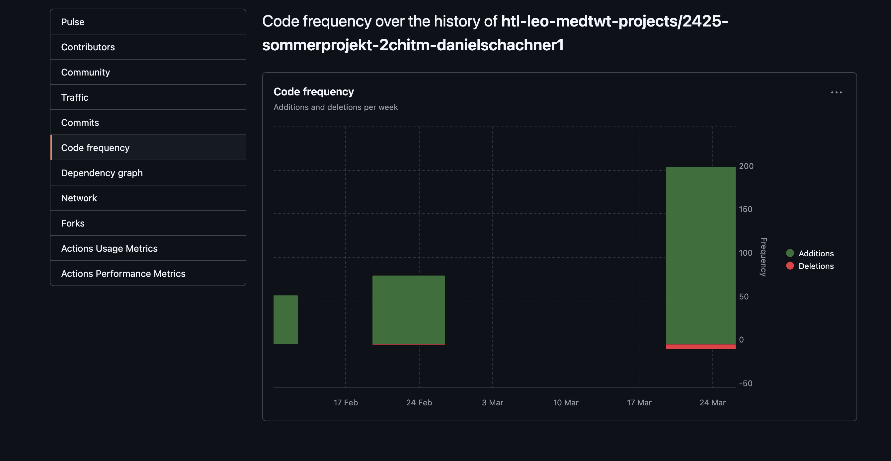
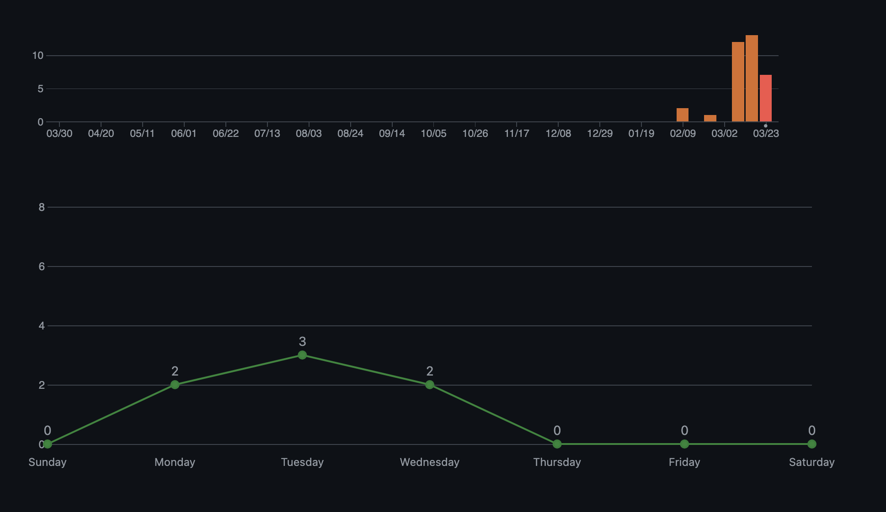
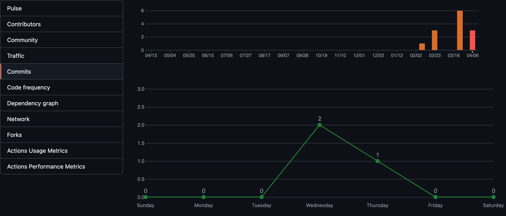
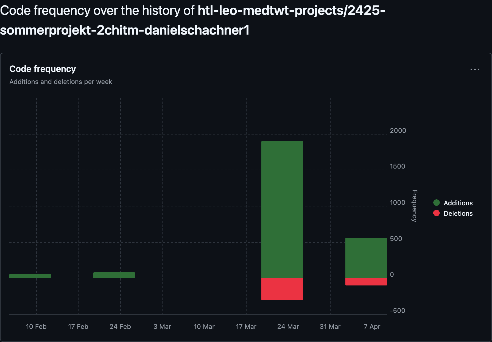

# Sprint-Dokumentation

## Name: Daniel Schachner

## Klasse: 2CHITM

## Projektname: FindYourSpace

## Link zum Github-Repo: https://github.com/htl-leo-medtwt-projects/2425-sommerprojekt-2chitm-danielschachner1.git

---

### Neuerungen seit dem letzten Sprint:

- **UI/UX-Prototyp**:

  - Implementierung der Navigationsleiste mit Links zu Startseite, Orte buchen und Community.
  - Integration des Hero-Bereichs mit Suchleiste und Hintergrundbild.
  - Erstellung des „Top-Bewertete Orte“-Abschnitts.
  - Hinzufügen einer interaktiven Karte mit Orten (mit **Leaflet.js**).

- **Design**:
  - Nutzung von **TailwindCSS** für ein ansprechendes, responsives Layout.
  - Gestaltung von Hover-Effekten und visuellem Design.

### Screenshot der GitHub-Insights Statistik:

### Ziele bis zum nächsten Sprint:

- Weiterentwicklung der interaktiven Karte.
- Filterfunktion für Orte nach Kategorien/Bewertungen.
- Vorbereitungen für die Backend-Integration.

---

### Neuerungen seit dem letzten Sprint:

- **UI/UX-Prototyp**:

  - Hinzufügen einer interaktiven Karte mit Orten (mit **Leaflet.js**).

- **Design**:

  - Nutzung von **TailwindCSS** für ein ansprechendes, responsives Layout.
  - Gestaltung von Hover-Effekten und visuellem Design.

- **Login-Funktionalität**:

  - Implementierung einer Login-Funktion über **LocalStorage**.
  - Validierung der Benutzerdaten und Fehlermeldungen bei fehlerhaften Logins.
  - Persistente Speicherung des Login-Status zwischen Browser-Sitzungen.

- **Dark Mode**:

  - Fixing von Dark-Mode-Problemen, um ein konsistentes Erscheinungsbild zu gewährleisten.

- **Filterfunktion**:

  - Weiterentwicklung der Filterfunktion für Orte nach Kategorien und Bewertungen.

- **Interaktive Karte (Leaflet.js)**:
  - Ausarbeitung der interaktiven Karte mit verbesserten Animationen und sanften Übergängen.
  - Hinzufügen eines Modals, das detaillierte Informationen zu einem Ort anzeigt, wenn ein Marker auf der Karte geklickt wird.

---

### Screenshot der GitHub-Insights Statistik:

  

---

### Ziele bis zum nächsten Sprint:

### Ziele bis zum nächsten Sprint:

1. **Suchfunktion auf der Startseite fertigstellen**:

   - Implementierung eines Vorschlagsmechanismus, der Orte basierend auf der Nutzereingabe anzeigt (z. B. "Bibliothek" zeigt alle Bibliotheken an).
   - Optimierung der Suchergebnisse für eine schnellere und präzisere Anzeige.

2. **Buchen-Funktion implementieren**:

   - Entwicklung einer Buchungsseite, auf der Nutzer Orte auswählen und buchen können.

3. **Konto-Management für angemeldete Nutzer**:

   - Implementierung eines Konto-Dashboards mit einer Übersicht über aktuelle und vergangene Buchungen.
   - Möglichkeit für Nutzer, ihre Buchungen zu stornieren oder zu bearbeiten.

4. **Persistente Buchungsdaten**:

   - Speicherung der Buchungsdaten im LocalStorage (oder später in einer Datenbank).  
   - Sicherstellen, dass Buchungen auch nach einem Seitenrefresh erhalten bleiben.

5. **Optimierung des Nutzerprofils**:
   - Erweiterung des Profilbereichs zur Verwaltung persönlicher Daten wie Name, E-Mail und bevorzugte Einstellungen.
   - Option für Nutzer, ihr Passwort zu ändern oder ihre Profildaten zu aktualisieren.

### Screenshot der GitHub-Insights Statisktik:

---

**Ende der Sprint-Dokumentation**
